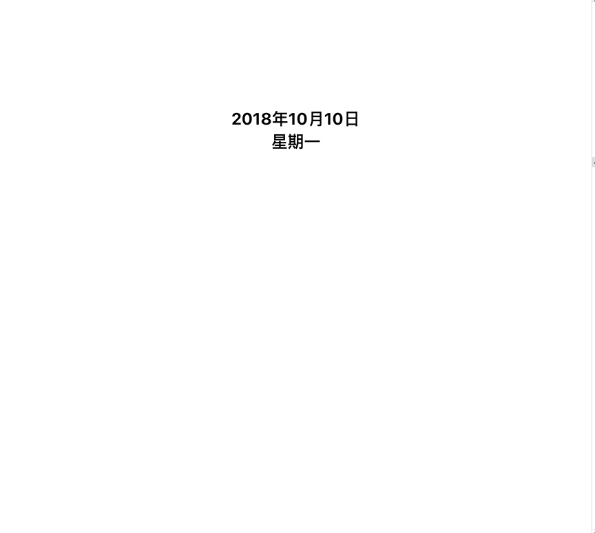

# css-pseudo-selector-demo
位类和伪元素和选择器


### `伪类`

```
a:link	//未访问的链接
a:visited //已访问的链接
a:hover //鼠标移动到链接上
a:active //选定的链接
```

```
例: a.red:visited， 被访问过的.red类的a标签的样式 
```

-
```
<div>
	<p>These are the necessary steps:</p>
	<ul>
		<li>Intert Key</li>
		<li>Turn key <strong>clockwise</strong></li>
		<li>Push accelerator</li>
	</ul>
	<p>Do <em>not</em> push the brake at the same time as the accelerator.</p>
</div>
```

在上面的例子中，作为第一个元素的元素包括第一个 p、第一个 li 和 strong 和 em 元素。

-

匹配所有\<p\> 元素中的第一个 \<i\> 元素

```
<html>
<head>
<style type="text/css">
	p > i:first-child {	//选择器匹配所有 <p> 元素中的第一个 <i> 元素：
  	 font-weight:bold;
   } 
</style>
</head>

<body>
<p>some <i>text</i>. some <i>text</i>.</p>
<p>some <i>text</i>. some <i>text</i>.</p>
</body>
</html>
```

-

匹配所有作为第一个子元素的\<p\> 元素中的所有\<i\> 元素

```
<html>
<head>
<style type="text/css">
	  p:first-child i {
	  	color:blue;
	  } 
</style>
</head>

<body>
	<p>some <i>text</i>. some <i>text</i>.</p>
	<p>some <i>text</i>. some <i>text</i>.</p>
</body>
</html>
```

-

:lang 伪类

:lang 伪类使你有能力为不同的语言定义特殊的规则。向带有指定 lang 属性的元素添加样式。

```
<html>
<head>

<style type="text/css">
		q:lang(no)
	   {
	  	 quotes: "~" "~"
	   }
</style>

</head>
	<body>
		<p>文字<q lang="no">段落中的引用的文字</q>文字</p>
	</body>
</html>
```


### `伪元素`

:first-line,用于第一行文本进行格式化

```
.slogan:first-line {
    color: red;
}
```


> 注释："first-line" 伪元素只能用于块级元素。

> 注释：下面的属性可应用于 "first-line" 伪元素：
> 
* font
* color
* background
* word-spacing
* letter-spacing
* text-decoration
* vertical-align
* text-transform
* line-height
* clear


"first-letter" 伪元素用于向文本的首字母设置特殊样式：

```
.slogan:first-letter {
    font-size: 300px;
}
```
> 注释："first-letter" 伪元素只能用于块级元素。


":before" 伪元素可以在元素的内容前面插入新内容。
":after" 伪元素可以在元素的内容之后插入新内容。

```
h1:before/after
{
  content:url(logo.gif);
}
```

### `选择器`

`.important.warning`,这样的选择器只能选择比这两个类更多的类修饰的元素。

属性选择器

```
a[href] {color:red;} //包含href的
a[href][title] {color:red;} //同时包含href和title的
a[href="http://www.w3school.com.cn/about_us.asp"] {color: red;} //属性满足该条件的
p[class~="important"] {color: red;} //class中包含important的
[abc^="def"]	//以def开头
[abc$="def"]	//def结尾
[abc*="def"]	//包含def
```

后代选择器

```
h1 em {color:red;}
```

子元素选择器

```
h1 > strong {color:red;}
```

相邻兄弟选择器

```
h1 + p {margin-top:50px;}
```
这个选择器读作：“选择紧接在 h1 元素后出现的段落，h1 和 p 元素拥有共同的父元素”。


### `实例`

<div style='text-align:center;'>
	
</div>

该实例运行了多种选择器和过渡效果。

```
<div id='parent2'>
                        <div>
                            <div>Hello World</div>
                        </div>
                        <div>
                            <div>Hello Lanyage</div>
                        </div>
</div>
```        

```
#parent2 > div:first-child{
    /* #parent2  div:first-child{ 代表#parent2下的所有:first-child */
    padding: 10px 50px ;
    background-color: #0086ff;
    font-size: 16px;
    font-weight: 900;
    color: #fff;
}
```
        
那么只有直接子元素会有这样的样式。

        